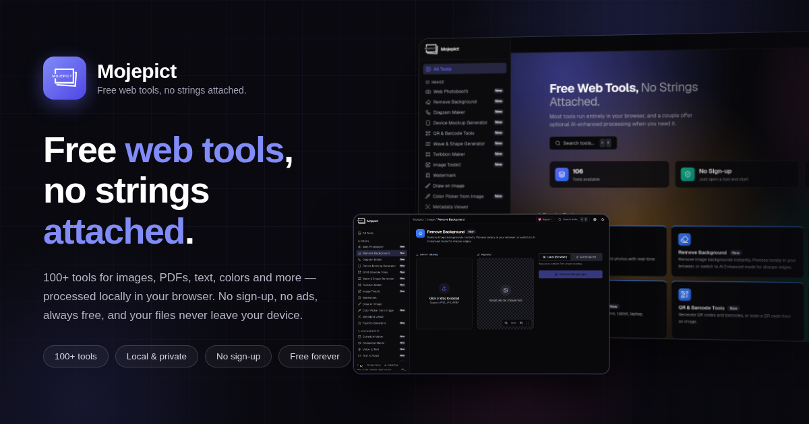

# Mojepict

**Free web tools, no strings attached.** 100+ tools that run right in your
browser — no sign-up, no ads, always free.



## About

Mojepict is a privacy-first toolbox for everyday tasks: editing images,
working with PDFs, converting units, generating QR codes, formatting JSON,
and much more. Your files never leave your device — almost everything is
processed locally in the browser using Web APIs, Canvas, and WASM. A couple
of image tools (Remove Background, Image Compressor) additionally offer an
optional **AI Enhanced** mode backed by a third-party API, but every tool
works fully without it.

## Highlights

- **100+ tools** across 8 categories, searchable via a ⌘K command palette
- **Local-first & private** — files are processed in your browser, not uploaded
- **No account needed** — open a tool and start working
- **Installable PWA** — works as an app, with offline support
- **Bilingual** — English and Bahasa Indonesia
- **Dark / light mode**, responsive on desktop and mobile

## Tool Catalog

| Category     | Examples                                                                                                                                                  |
| ------------ | --------------------------------------------------------------------------------------------------------------------------------------------------------- |
| Image        | Remove Background, Web Photobooth, Image Toolkit (convert, resize, compress, crop, split), Diagram Maker, Device Mockup, QR & Barcode Tools, Twibbon Maker, Watermark, Draw on Image, SVG Tracer, Favicon Generator, Wave & Shape Generator, Metadata Viewer, Color Picker from Image |
| PDF          | PDF Toolkit — merge, split, edit, image ↔ PDF, PDF to Markdown                                                                                             |
| Productivity | Schedule Maker, Broadcast Maker, Voice to Text, Text to Voice, Universal Converter                                                                          |
| Developer    | JSON Formatter, Code to Image, Regex Tester, HTML Viewer, Encoder/Decoder (URL, JWT, hash, UUID…), Meta Tag Generator, Random Generator                     |
| Text         | Markdown Previewer, Text Diff Checker, Word Counter, Text Tools (case converter, lorem ipsum…)                                                              |
| Color        | Color Picker, Color Palette Generator, Gradient Generator, Contrast Checker                                                                                 |
| Math         | Finance Calculator, Zakat Calculator, BMI Calculator, Date Calculator                                                                                       |
| Unit         | Unit Converter (length, weight, data storage, physics…)                                                                                                     |

## Tech Stack

Next.js (App Router) · React · Tailwind CSS · shadcn/ui · onnxruntime-web ·
pdf-lib / pdf.js · Excalidraw

## Run Locally

```bash
nvm use && yarn install && yarn dev
```

Open [http://localhost:3000](http://localhost:3000). No configuration
required — optional API keys for the AI Enhanced modes are documented in
`.env.example`.

## License

[MIT](LICENSE) © [mujahidin](https://mujahidin.my.id)
